## Choe, B.-H., [Climate Finance under Limited Commitment and Renegotiations: A Dynamic Contract Approach](https://www.mdpi.com/1911-8074/19/1/76), _Journal of Risk and Financial Management_ (2026)

 

### First-best Benchmark

<table align="center">
  <tr>
    <td align="center" width="50%">
      
       
      <b>(a)</b> Climate cost C_FB(G)
    </td>
    <td align="center" width="50%">
      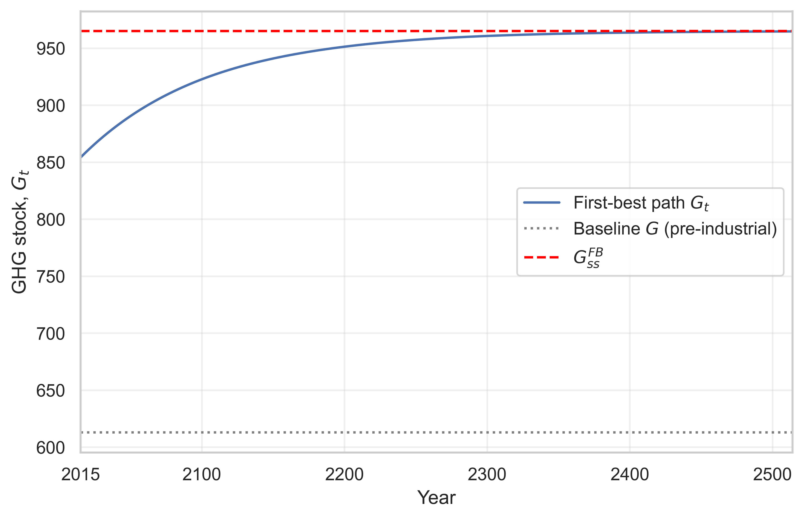
       
      <b>(b)</b> Dynamics of GHG stock
    </td>
  </tr>

  <tr>
    <td align="center" width="50%">
      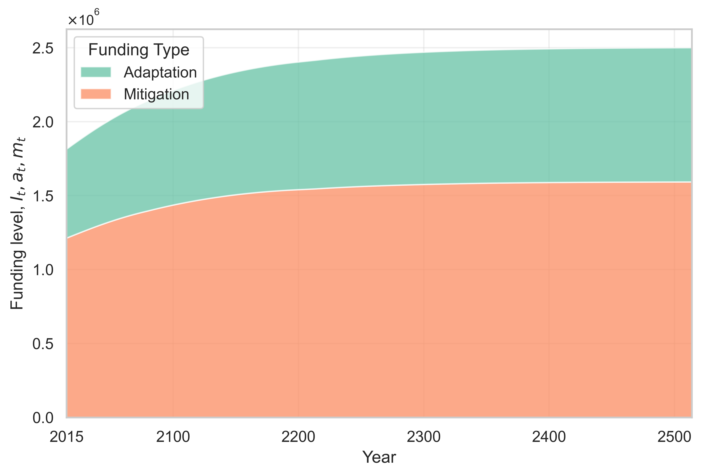
       
      <b>(c)</b> Adaptation and mitigation funding levels
    </td>
    <td align="center" width="50%">
      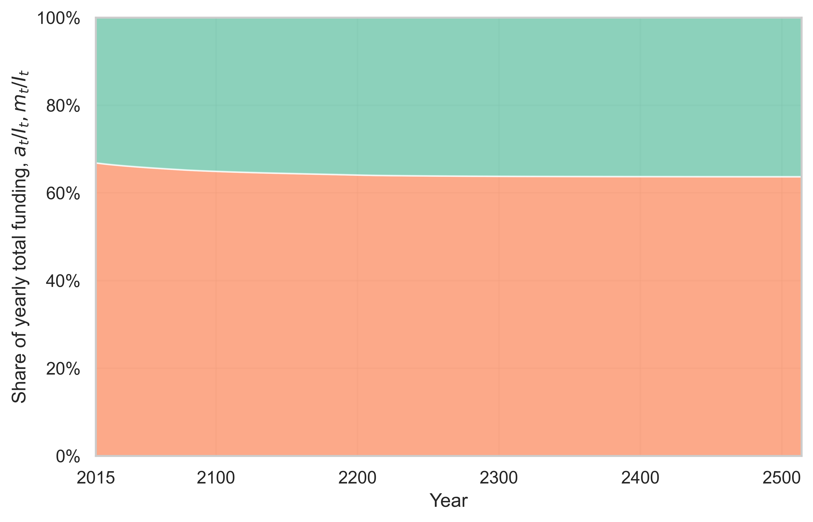
       
      <b>(d)</b> Adaptation and mitigation funding shares
    </td>
  </tr>
</table>

 

  <b>Figure 1.</b> First-best benchmarks. Author's own elaboration.

 

### Second-best Simulation

<table align="center">
  <tr>
    <td align="center" width="50%">
      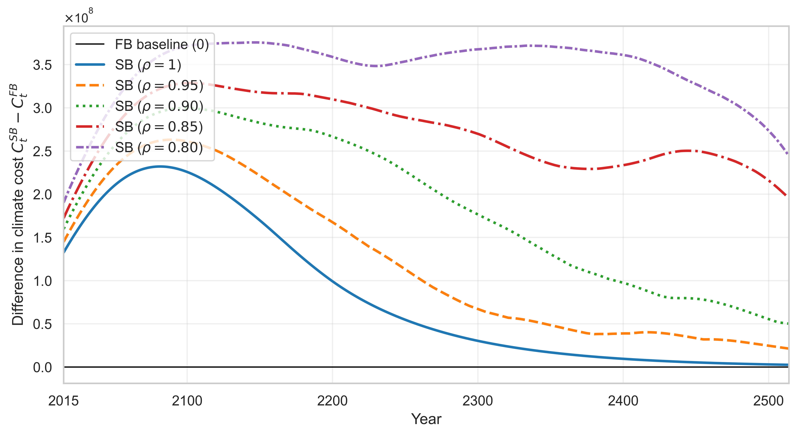
       
      <b>(a)</b> Difference in climate cost: C(w_t, G_t) − C_FB(G_t)
    </td>
    <td align="center" width="50%">
      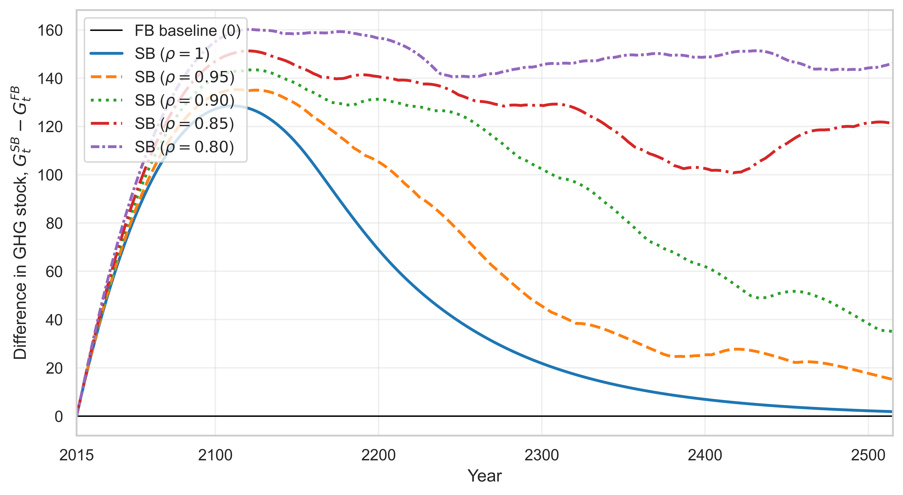
       
      <b>(b)</b> Difference in GHG stock: G_SB,t − G_FB,t
    </td>
  </tr>

  <tr>
    <td align="center" width="50%">
      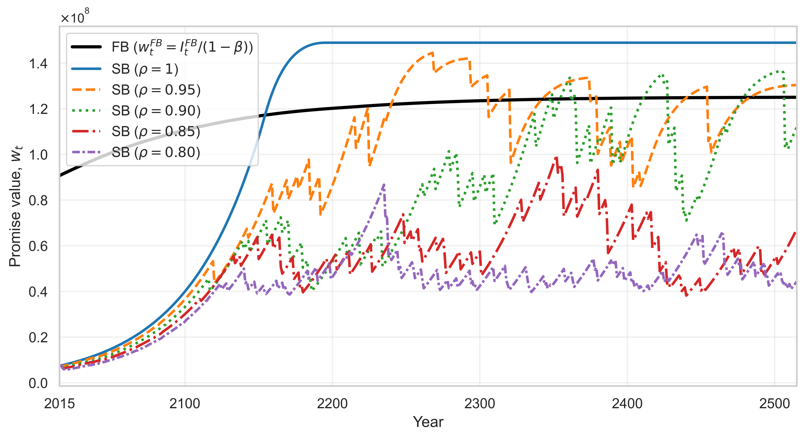
       
      <b>(c)</b> Promised contribution value: w_t
    </td>
    <td align="center" width="50%">
      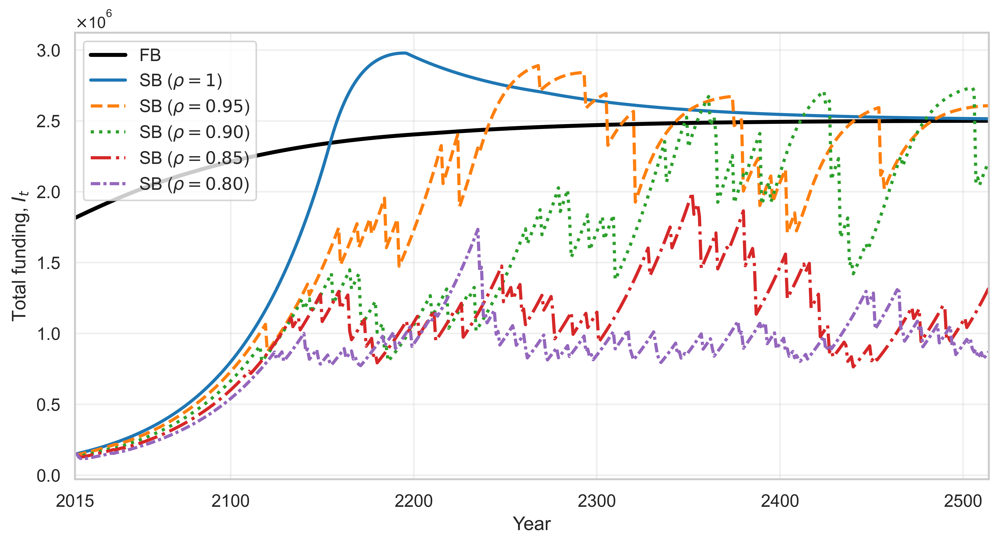
       
      <b>(d)</b> Total funding: I_t
    </td>
  </tr>

  <tr>
    <td align="center" width="50%">
      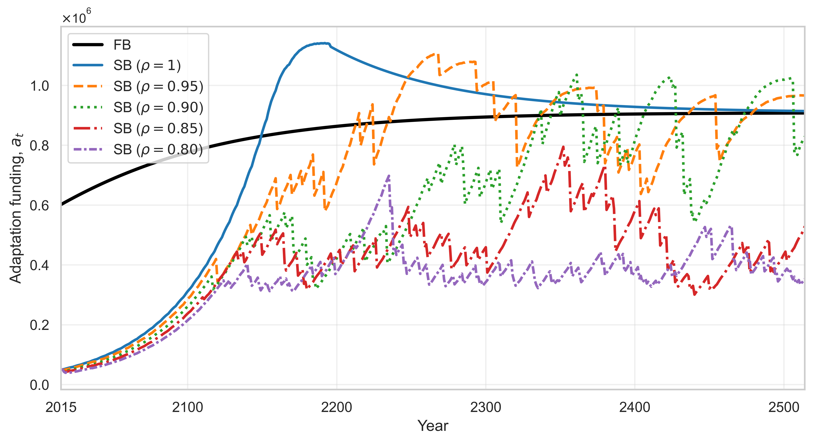
       
      <b>(e)</b> Adaptation funding: a_t
    </td>
    <td align="center" width="50%">
      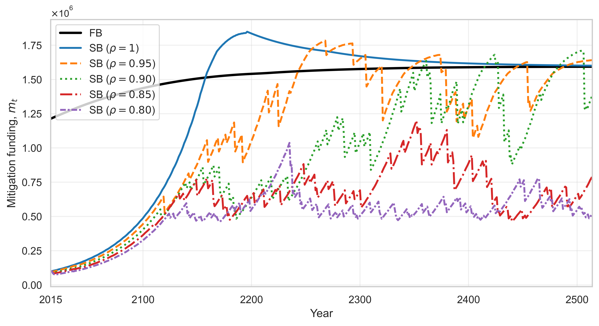
       
      <b>(f)</b> Mitigation funding: m_t
    </td>
  </tr>

  <tr>
    <td align="center" width="50%">
      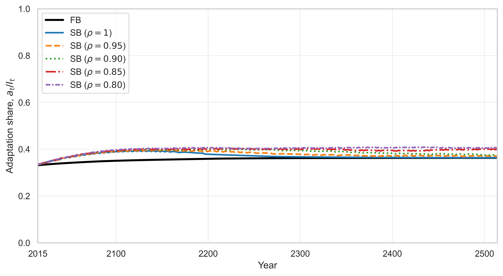
       
      <b>(g)</b> Adaptation share: a_t / I_t
    </td>
    <td align="center" width="50%">
      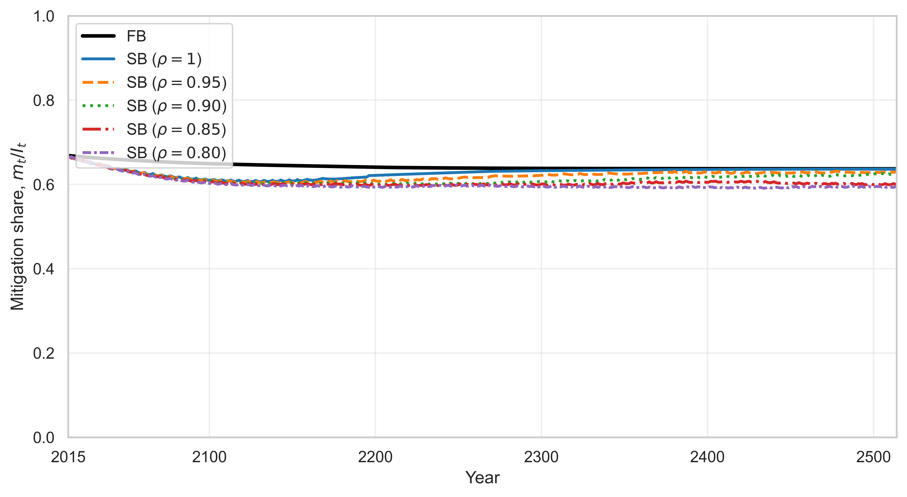
       
      <b>(h)</b> Mitigation share: m_t / I_t
    </td>
  </tr>
</table>

 

  <b>Figure 2.</b> Comparison of dynamics under the first-best and the second-best (SB) contract for probabilities of contract enforcement
  rho in {0.80, 0.85, 0.90, 0.95, 1.00}, with initial total funding set to 8% of the first-best level in 2015.
  Author's own elaboration.

The author does not numerically solve the full Bellman problem in this repository because a global solution is computationally intensive and highly sensitive to grid construction and interpolation choices. Nevertheless, a full-solution implementation can reproduce the patterns shown in Figure 2.

